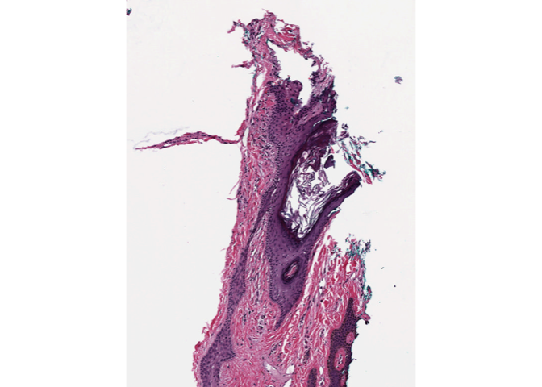
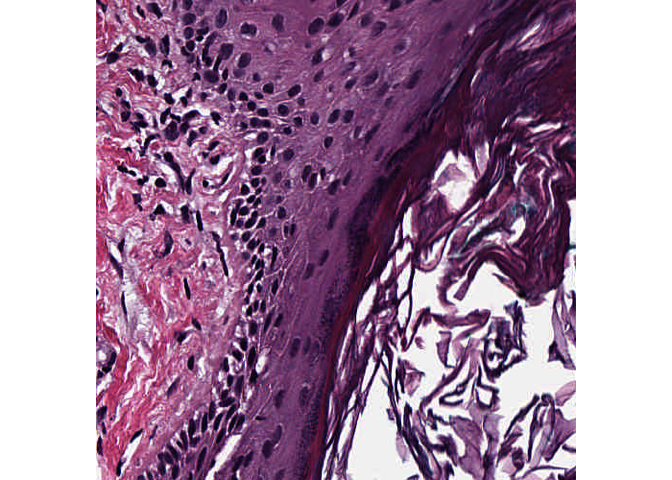

<!-- README.md is generated from README.Rmd. Please edit that file -->

# slidetool

<!-- badges: start -->

<!-- badges: end -->

Retrieve Data From Whole Slide Images in R

## Overview

`slidetool` is an R package that leverages OpenSlide to interact with
whole slide images, also known as virtual slide files. It provides
functions to extract metadata, list associated images, read specific
regions of slides, and more.

## Installation

### Installing the development version

You can install the development version of slidetool from
[GitHub](https://github.com/) with:

``` r
remotes::install_github("luciorq/slidetool")
# or
pak::pkg_install("github::luciorq/slidetool")
```

## Usage

``` r
library(slidetool)
```

Next, install OpenSlide dependencies using the `install_slidetool()`
function:

``` r
install_slidetool()

slidetool("--version") |>
  _$stderr |>
  message()
#> slidetool 4.0.0, using OpenSlide 4.0.0
#> Copyright (C) 2007-2023 Carnegie Mellon University and others
#> 
#> OpenSlide is free software: you can redistribute it and/or modify it under
#> the terms of the GNU Lesser General Public License, version 2.1.
#> <http://gnu.org/licenses/lgpl-2.1.html>
#> 
#> OpenSlide comes with NO WARRANTY, to the extent permitted by law.  See the
#> GNU Lesser General Public License for more details.
```

List associated images for a slide:

``` r
# Replace with the path to your slide file
slide_path <- fs::path_package("slidetool", "extdata", "CMU-1-Small-Region.svs")

associated_images <- slidetool_assoc_list(slide_path)
print(associated_images)
#> [1] "label"     "macro"     "thumbnail"
```

Read Thumbnail from a SVS file:

``` r
thumb_path <- slidetool_assoc_read(slide_path, assoc = "thumbnail")

img_obj <- EBImage::readImage(thumb_path)
EBImage::display(img_obj, method = "raster")
```



Extract a specific region from a slide and save it as a PNG image:

``` r
# Define parameters
x_coord <- 1000
y_coord <- 1000
level <- 0
width <- 500
height <- 500
# output_file <- fs::file_temp(pattern = "region", ext = "png")

# Read the region
region_path <- slidetool_region_read(
  path = slide_path,
  x = x_coord,
  y = y_coord,
  level = level,
  width = width,
  height = height
)

# Check if the file was created
if (file.exists(region_path)) {
  message("Region saved to ", region_path)
}
#> Region saved to /var/folders/2q/937_bkg10svdwx1x00prs9nm0000gn/T/RtmpFK67yi/region13dc552329b99.png
```

``` r
img_obj <- EBImage::readImage(region_path)
print(img_obj)
#> Image 
#>   colorMode    : Color 
#>   storage.mode : double 
#>   dim          : 500 500 4 
#>   frames.total : 4 
#>   frames.render: 1 
#> 
#> imageData(object)[1:5,1:6,1]
#>            [,1]       [,2]       [,3]      [,4]      [,5]      [,6]
#> [1,] 0.26274510 0.29019608 0.44313725 0.5882353 0.6431373 0.7137255
#> [2,] 0.07058824 0.07450980 0.21568627 0.4078431 0.5490196 0.6980392
#> [3,] 0.14901961 0.05882353 0.08627451 0.2274510 0.3764706 0.5529412
#> [4,] 0.33333333 0.15294118 0.06666667 0.1294118 0.2745098 0.4862745
#> [5,] 0.48627451 0.28235294 0.14901961 0.1529412 0.2627451 0.5019608
```

``` r
EBImage::display(img_obj, method = "raster")
```



Get all OpenSlide properties and their values:

``` r
properties <- slidetool_prop_list(slide_path)
print(names(properties))
#>  [1] "aperio.AppMag"                        
#>  [2] "aperio.Date"                          
#>  [3] "aperio.Filename"                      
#>  [4] "aperio.Filtered"                      
#>  [5] "aperio.Focus Offset"                  
#>  [6] "aperio.ImageID"                       
#>  [7] "aperio.Left"                          
#>  [8] "aperio.LineAreaXOffset"               
#>  [9] "aperio.LineAreaYOffset"               
#> [10] "aperio.LineCameraSkew"                
#> [11] "aperio.MPP"                           
#> [12] "aperio.OriginalHeight"                
#> [13] "aperio.OriginalWidth"                 
#> [14] "aperio.Originalheight"                
#> [15] "aperio.Parmset"                       
#> [16] "aperio.ScanScope ID"                  
#> [17] "aperio.StripeWidth"                   
#> [18] "aperio.Time"                          
#> [19] "aperio.Top"                           
#> [20] "aperio.User"                          
#> [21] "openslide.associated.label.height"    
#> [22] "openslide.associated.label.width"     
#> [23] "openslide.associated.macro.height"    
#> [24] "openslide.associated.macro.width"     
#> [25] "openslide.associated.thumbnail.height"
#> [26] "openslide.associated.thumbnail.width" 
#> [27] "openslide.comment"                    
#> [28] "openslide.level-count"                
#> [29] "openslide.level[0].downsample"        
#> [30] "openslide.level[0].height"            
#> [31] "openslide.level[0].tile-height"       
#> [32] "openslide.level[0].tile-width"        
#> [33] "openslide.level[0].width"             
#> [34] "openslide.mpp-x"                      
#> [35] "openslide.mpp-y"                      
#> [36] "openslide.objective-power"            
#> [37] "openslide.quickhash-1"                
#> [38] "openslide.vendor"                     
#> [39] "tiff.ImageDescription"                
#> [40] "tiff.ResolutionUnit"
print(properties["openslide.level-count"])
#> openslide.level-count 
#>                   "1"
```

Retrieve the value of a specific property:

``` r
property_name <- "openslide.vendor"
property_value <- slidetool_prop_get(slide_path, property_name)
print(paste0(property_name, ": ", property_value))
#> [1] "openslide.vendor: aperio"
```

``` r
# magick::image_read(region_path)
```

## License

This project is licensed under the GNU AFFERO GENERAL PUBLIC LICENSE
v3+. See the [LICENSE](./LICENSE.md) file for details.

## Contributing

Contributions are welcome! Please submit issues and pull requests on the
[GitHub repository](https://github.com/luciorq/slidetool).

------------------------------------------------------------------------

## Aknowledgments

- [OpenSlide](https://openslide.org/) for providing a reliable interface
  to read whole slide images.
- [condathis](https://github.com/luciorq/condathis) for environment
  management.
